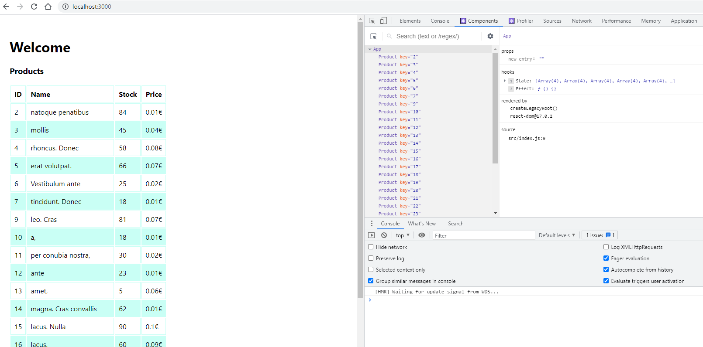

# flower-shop

Python version: 3.8

React-Flask-PostgreSQL-Docker web application.

To run the application run these commands in project folder:
````
docker-compose up -d
yarn start
yarn start-api
````

TODO
* Fix frontend Dockerfile & docker-compose.yml so it starts up both backend and frontend correctly so no yarn 
commands are needed -> make better folder structure, src+public+package.json to frontend folder and backend separately 
* Add SQLAlchemy or do something to send beautiful json to frontend so no product[0], product[1], etc is needed, 
instead, product.id, product.name, etc
* Pagination
* More endpoints & popularity by orders


